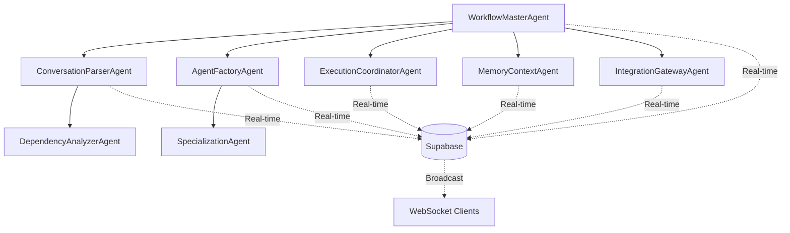

# Multi-Agent Workflow System

A sophisticated AI agent orchestration system built with Google ADK, Supabase, and LangGraph for production-ready multi-agent workflows with real-time capabilities.

## 🏗️ Architecture Overview

The system implements a hub-and-spoke architecture with the **WorkflowMasterAgent** as the central orchestrator coordinating specialized agents through real-time communication via Supabase.

### Core Agents

1. **WorkflowMasterAgent** - Central orchestrator with intelligent routing
2. **ConversationParserAgent** - Advanced NLP processing and workflow generation  
3. **AgentFactoryAgent** - Dynamic agent creation and Google Cloud deployment
4. **ExecutionCoordinatorAgent** - Multi-agent workflow execution and monitoring
5. **MemoryContextAgent** - Persistent memory and MCP server management
6. **IntegrationGatewayAgent** - External service integration and API management

### Key Features

- 🧠 **Intelligent Routing** - ML-based intent classification with confidence scoring
- 🔄 **Real-time State Management** - Supabase Postgres Changes and Broadcast channels
- 📊 **Workflow Visualization** - LangGraph-based DAG generation and optimization
- ☁️ **Cloud-Native Deployment** - Google Cloud Run with auto-scaling
- 🔧 **Dynamic Agent Creation** - Runtime agent generation and deployment
- 💾 **Persistent Memory** - MCP server integration for context management
- 📈 **Performance Monitoring** - Real-time metrics and health monitoring

## 🚀 Quick Start

### Prerequisites

- Python 3.11+
- Google Cloud Project with AI Studio API enabled
- Supabase project with real-time enabled
- WorkOS account (optional, for authentication)

### Installation

1. **Clone and setup environment:**
```bash
git clone <repository-url>
cd agentflow
python3 -m venv venv
source venv/bin/activate  # On Windows: venv\Scripts\activate
pip install -r requirements.txt
```

2. **Configure environment variables:**
```bash
cp env_example.txt .env
# Edit .env with your API keys and configuration
```

Required environment variables:
```env
GOOGLE_API_KEY=your_google_api_key_here
GOOGLE_PROJECT_ID=your_google_project_id
SUPABASE_URL=your_supabase_url_here
SUPABASE_ANON_KEY=your_supabase_anon_key_here
SUPABASE_SERVICE_ROLE_KEY=your_supabase_service_role_key_here
```

3. **Set up Supabase database schema:**

Create the following tables in your Supabase project:

```sql
-- Workflow state management
CREATE TABLE workflow_state (
    id TEXT PRIMARY KEY,
    key TEXT NOT NULL,
    value JSONB,
    request_id TEXT,
    updated_at TIMESTAMP WITH TIME ZONE DEFAULT NOW()
);

-- Agent registry
CREATE TABLE agent_registry (
    id TEXT PRIMARY KEY,
    name TEXT NOT NULL,
    type TEXT,
    status TEXT,
    capabilities JSONB,
    created_at TIMESTAMP WITH TIME ZONE DEFAULT NOW()
);

-- Conversation memory
CREATE TABLE conversation_memory (
    id TEXT PRIMARY KEY,
    request_id TEXT,
    context JSONB,
    query TEXT,
    session_id TEXT,
    timestamp TIMESTAMP WITH TIME ZONE DEFAULT NOW()
);

-- Workflow execution plans
CREATE TABLE execution_plans (
    id TEXT PRIMARY KEY,
    plan_id TEXT,
    request_id TEXT,
    workflow_plan JSONB,
    status TEXT,
    created_at TIMESTAMP WITH TIME ZONE DEFAULT NOW()
);

-- Enable real-time subscriptions
ALTER PUBLICATION supabase_realtime ADD TABLE workflow_state;
ALTER PUBLICATION supabase_realtime ADD TABLE agent_registry;
```

4. **Run the application:**
```bash
python main.py
```

The system will start on `http://localhost:8000` with:
- REST API endpoints at `/workflow/execute`
- WebSocket connections at `/ws/{client_id}`
- Health monitoring at `/health`
- Interactive docs at `/docs`

## 🔧 System Architecture

### Communication Patterns



### Agent Responsibilities

#### WorkflowMasterAgent
- **Intelligent Routing** - ML-based intent classification
- **Global State Management** - Real-time state synchronization
- **Workflow Coordination** - Multi-agent orchestration
- **Real-time Broadcasting** - Low-latency message distribution

#### ConversationParserAgent  
- **NLP Processing** - Gemini-powered entity extraction
- **Workflow Generation** - LangGraph DAG creation
- **Dependency Analysis** - Bottleneck identification and optimization
- **Context Enrichment** - User preference integration

#### AgentFactoryAgent
- **Dynamic Generation** - Runtime agent creation
- **Cloud Deployment** - Google Cloud Run integration
- **Gemini Configuration** - Model optimization
- **Registry Management** - Agent lifecycle tracking

## 📚 Usage Examples

### Basic Workflow Execution

```python
import httpx

# Execute a simple workflow
response = httpx.post("http://localhost:8000/workflow/execute", json={
    "request": "Create a data analysis agent and process the latest sales data",
    "user_id": "user_123",
    "context": {
        "data_source": "sales_db",
        "analysis_type": "trend_analysis"
    }
})

result = response.json()
print(f"Workflow Status: {result['status']}")
print(f"Execution Time: {result['execution_time']}s")
```

### Real-time Updates via WebSocket

```javascript
const ws = new WebSocket('ws://localhost:8000/ws/client_123');

ws.onmessage = function(event) {
    const data = JSON.parse(event.data);
    console.log('Real-time update:', data);
    
    if (data.type === 'workflow_update') {
        updateWorkflowProgress(data.payload);
    }
};

ws.send(JSON.stringify({
    type: 'subscribe',
    channels: ['workflow_updates', 'agent_status']
}));
```

### Complex Multi-Step Workflow

```python
# Complex workflow with multiple agents
workflow_request = {
    "request": """
    1. Parse this customer feedback data and extract sentiment
    2. Create a specialized analysis agent for retail feedback
    3. Deploy the agent to process the data in parallel
    4. Generate a comprehensive report with recommendations
    5. Store results in the knowledge base for future reference
    """,
    "context": {
        "data_format": "csv",
        "feedback_volume": "10000_records",
        "industry": "retail",
        "priority": "high"
    }
}

response = httpx.post("http://localhost:8000/workflow/execute", json=workflow_request)
```

## 🛠️ Development

### Project Structure

```
agentflow/
├── agents/                     # Agent implementations
│   ├── workflow_master_agent/  # Central orchestrator
│   ├── conversation_parser_agent/ # NLP processing
│   ├── agent_factory_agent/    # Dynamic agent creation
│   ├── execution_coordinator_agent/ # Workflow execution
│   ├── memory_context_agent/   # Persistent memory
│   └── integration_gateway_agent/ # External integrations
├── config/                     # Configuration management
├── utils/                      # Utility modules
├── main.py                     # FastAPI application
├── requirements.txt            # Python dependencies
└── README.md                   # This file
```

### Agent Template Structure

Each agent follows the Google ADK pattern:

```
agent_name/
├── __init__.py
├── agent_name.py              # Main agent implementation
├── instructions.py            # Agent prompts and instructions
├── tools.py                   # Agent-specific tools
└── sub_agents/                # Sub-agent implementations
```

### Adding New Agents

1. Create agent directory structure
2. Implement agent following ADK patterns
3. Add tools and instructions
4. Register in WorkflowMasterAgent
5. Update routing logic

### Testing

```bash
# Run unit tests
python -m pytest tests/

# Run integration tests
python -m pytest tests/integration/

# Run load tests
python -m pytest tests/load/
```

## 🔐 Security

- **API Key Management** - Secure credential storage
- **Role-based Access** - WorkOS integration
- **Data Encryption** - End-to-end encryption
- **Audit Logging** - Comprehensive activity tracking
- **Rate Limiting** - API protection mechanisms

## 📊 Monitoring

### Health Endpoints

- `GET /health` - System health status
- `GET /agents/status` - Agent availability
- `GET /workflow/status/{id}` - Workflow progress

### Metrics Collection

- Request latency and throughput
- Agent performance metrics
- Resource utilization
- Error rates and patterns
- Cost tracking

### Real-time Dashboards

Connect to WebSocket endpoints for live monitoring:

```javascript
// Monitor system metrics
const metricsWs = new WebSocket('ws://localhost:8000/ws/metrics');
metricsWs.onmessage = (event) => {
    const metrics = JSON.parse(event.data);
    updateDashboard(metrics);
};
```

## 🚀 Deployment

### Local Development

```bash
python main.py
```

### Docker Deployment

```dockerfile
FROM python:3.11-slim
WORKDIR /app
COPY requirements.txt .
RUN pip install -r requirements.txt
COPY . .
CMD ["python", "main.py"]
```

### Google Cloud Run

```bash
gcloud run deploy agentflow \
    --source . \
    --platform managed \
    --region us-central1 \
    --allow-unauthenticated
```

### Environment Configuration

Production environment variables:

```env
ENVIRONMENT=production
DEBUG=false
LOG_LEVEL=INFO
API_HOST=0.0.0.0
API_PORT=8080
GOOGLE_PROJECT_ID=your-production-project
SUPABASE_URL=https://your-prod-supabase.supabase.co
```

## 🤝 Contributing

1. Fork the repository
2. Create a feature branch
3. Follow Google ADK patterns
4. Add comprehensive tests
5. Submit a pull request

### Code Standards

- Follow PEP 8 styling
- Use type hints
- Add docstrings for all functions
- Implement comprehensive error handling
- Include performance benchmarks

## 📄 License

Licensed under the Apache License, Version 2.0. See LICENSE file for details.

## 📞 Support

- **Documentation**: [Google ADK Docs](https://google.github.io/adk-docs/)
- **Issues**: Create GitHub issues for bugs
- **Discussions**: Use GitHub Discussions for questions
- **Email**: support@your-domain.com

---

**Built with ❤️ using Google ADK, Supabase, and LangGraph** 